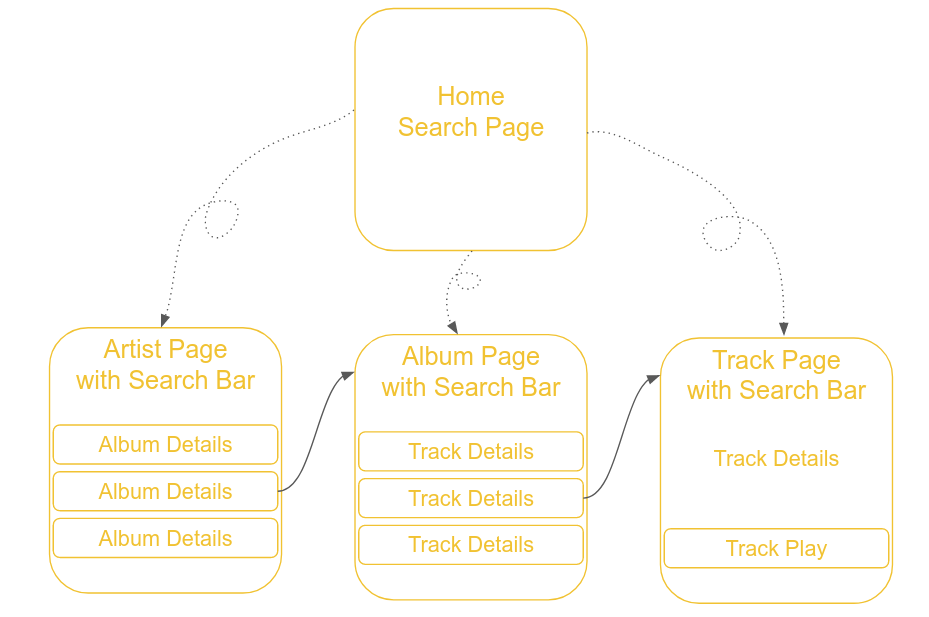
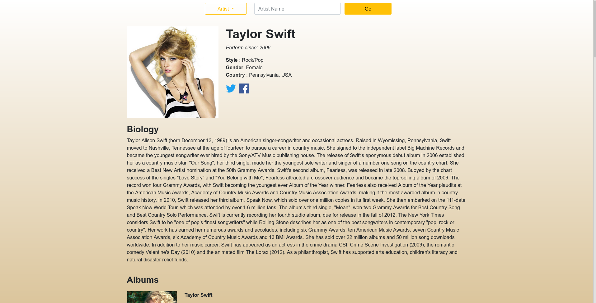
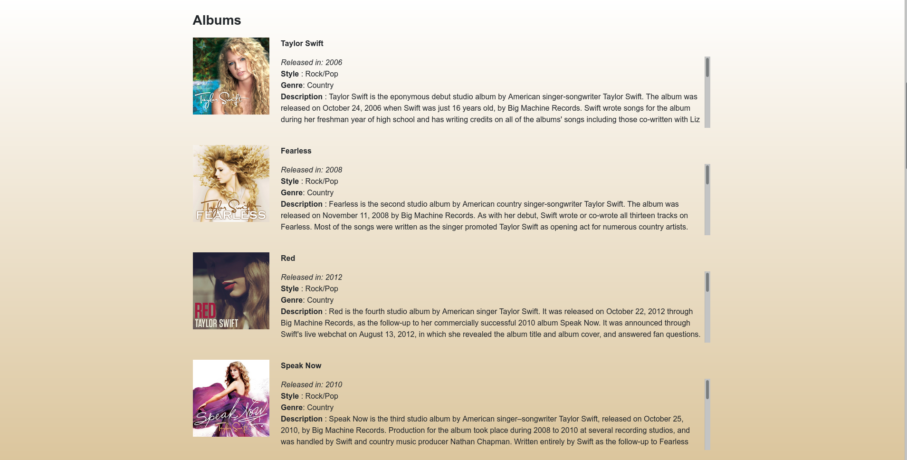
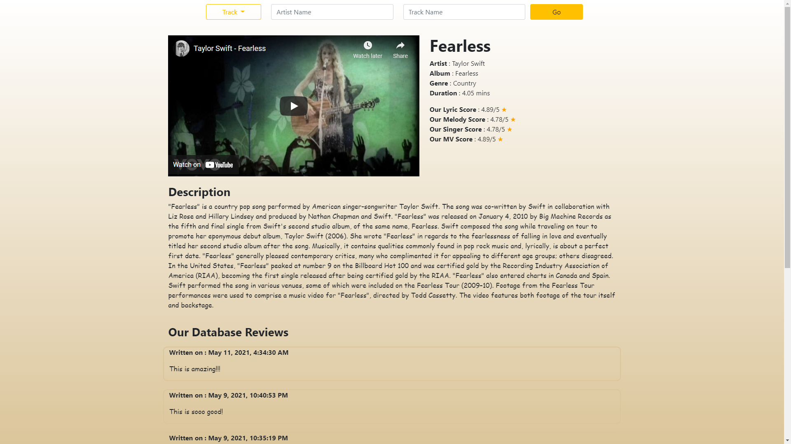
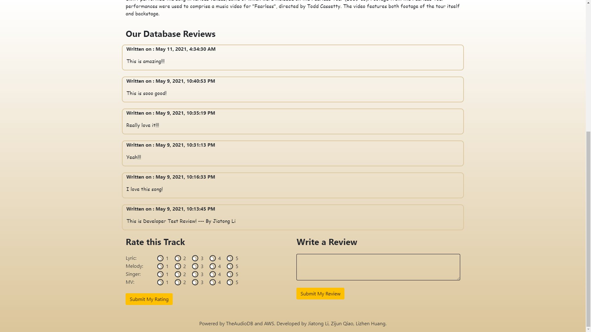

# Music-Ranking-Comment-and-Streaming-Platform

## Author

Jiatong Li

lijiaton@usc.edu

## Introduction

In this project, I built a platform for music lovers to rank, comment, and listen to the music they love. Users can search for artist, album or track through its name. On the music profile page, users can see the detailed information, share their own ratings about lyric, melody, singer or mv as well as share their reviews.

### Links to my application (no longer available)

Stable version can be found at:

http://ee599musics-env.eba-xmjfgjfi.us-west-1.elasticbeanstalk.com

More features version can be found at:

http://ee599music-env.eba-xycuv9fu.us-east-2.elasticbeanstalk.com

### Video Demo on Youtube

[](https://www.youtube.com/watch?v=Yb-KuKEXqoo&t=40s)

## Details

There are four pages in this web app: Home, Artist, Album and Track. The search bar in Home page takes you to any one of the album, artist or track details page. Cover images of albums takes you to the corresponding album page. Cover images of tracks takes you to the corresponding track page.

<p align="center"></p>

<p align="center">Music Platform Routing Logics</p>

The artist details page looks like the followings, sharing the same layout as the album details page.

<p align="center"></p>

<p align="center"></p>

The track details page looks like the followings.

<p align="center"></p>

<p align="center"></p>

## Deployment

Please pre-install Node.js in both Backend Server and Frontend Server to deploy our product.

Create your own database and import the schema.sql under backend_jiatong folder to your database.

Log in your backend instance and move the backend_jiatong folder to the backend instance.

Change the information in mysql.json under backend_jiatong folder according to your setting and do:

```
cd backend_jiatong
npm install
chmod start_server.sh
./start_server.sh
```

Then, you backend server should work.

To deploy the frontend program, log in to your frontend instance do the following:

```
cd deployBeanstalk
npm install
node server.js
```

Or, you can simply upload the deployBeanstalk.zip to AWS Beanstalk platform.

Then, you backend server should work.

(To change the data source to your own backend, your need to change the URL-prefix in the frontend-jiatong's Angular Project's services and rebuild the pages.)

<p align="center"></p>

<p align="center">This project was completely deployed on AWS</p>

## Jiatong Li's Development Instructions

To run the backend part on local host, use the following:

```
cd  backend_jiatong
npm install
node server.js
```

Then the URL prefix for the apis is:
```
http://localhost:8080
```

To romotely access the backend already deployed to AWS, the URL prefix for the apis is:

```
http://ec2-18-144-45-158.us-west-1.compute.amazonaws.com:8080
```

for backend apis:

 - /api/artist_search?artist_name={artist name}
 - /api/album_search?artist_name={artist name}&album_name={album name}
 - /api/track_search?artist_name={artist name}&track_name={track name}
 - /api/artist_details?id={artist id}
 - /api/album_artist?id={TADB_Artist_ID}
 - /api/track_album?id={TADB_Album_ID}
 - /api/trackVideo_track?track_id={TADB_TRACK_ID}&artist_id={TADB_Artist_ID}

 - /api//post_score  (POST HTTP: please include track_id, lyric_score, melody_score, singer_score, mv_score in the body)
 - /api//post_review  (POST HTTP: please include track_id, review in the body)

### Some Advices for Team

 - Everyone creates his/her own folder and codes from there, for easier updating main branch. 
 
 - Do not submit node_modules to the version control platform

   To do so, add node_modules/ to the .gitignore file (if do not exist, create one).
   
 - backend branch will keep changing, and merging into the main branch, pull the repository before developing every time to keep things up to date
